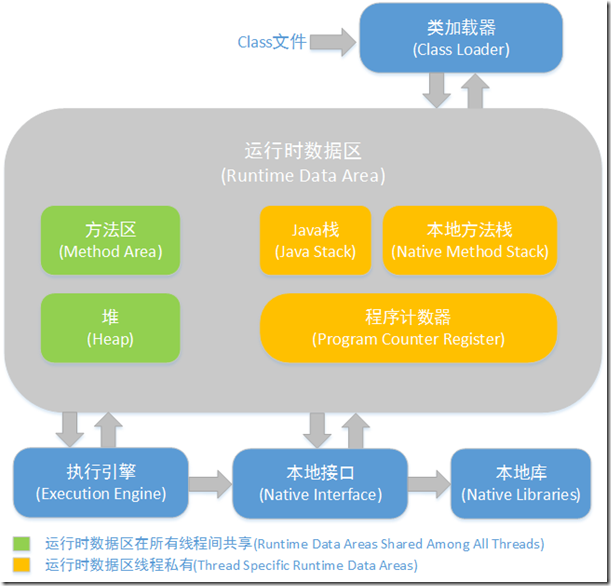

# Java进程VIRT、RES很高，JVM占用很小

## 情景描述

* top 查看Java进程。VIRT（9G）、RES（2G）。
* 感觉内存占用有问题，VIRT倒觉得没啥，RES就太多了。
* jamp dump出来的文件却只有750M左右。
* 稍微分析了一下后，虽然觉着内存有点疑虑，但是肯定不是主要原因。
* 然后了解到jvm分对内内存heap、堆外内存，这就尴尬了，以前见识少啊。

## RES、VIRT说明

简单来说，VIRT是只要jvm申请新的内存，就会累加，不减。RES可基本认为是进程所占用的物理内存。

## JDK 8 内存区域、内存模型

**堆外内存：**

运行时数据区域:

* 程序计数器：线程私有的
* Java虚拟机栈：线程私有的
* 本地方法栈
* Java堆
* 方法区

JDK8中把存放元数据中的永久内存从堆内存中移到了本地内存\(native memory\)中。

除JVM占有的内存外，剩余的内存都可以被metaspace占有。

永久代替换成Metaspace的好处： 1. 字符串存在永久代中，容易出现性能问题和内存溢出。 2. 类及方法的信息等比较难确定其大小，因此对于永久代的大小指定比较困难，太小容易出现永久代溢出，太大则容易导致老年代溢出。 3. 永久代会为 GC 带来不必要的复杂度，并且回收效率偏低。

为什么新生代内存需要有两个Survivor区：

> 有一个前提，就是新生代一般都采用复制算法进行垃圾收集。原始的复制算法是把一块内存一分为二， gc 时把存活的对象从一块空间（From space）复制到另外一块空间（To space），再把原先的那块内存（From space）清理干净，最后调换 From space 和 To space 的逻辑角色（这样下一次 gc 的时候还可以按这样的方式进行）。

1. 为什么要有Survivor区：
   * 减少被送到老年代的对象，进而减少Full GC的发生，Survivor的预筛选保证，只有经历16次Minor GC还能在新生代中存活的对象，才会被送到老年代。
2. 为什么要设置两个Survivor区：
   * 如果只有一个：gc时间不合理（即会把Eden和Survivor循环交换）；会出现内存碎片化的问题。简单描述就是：
     * Eden满了
     * 触发一次Minor GC
     * Eden中的存活对象就会被移动到Survivor区（假设是1-10的位置都被占了）
     * Eden满了
     * 触发一次Minor GC
     * Survivor区的4-7位置的对象被回收了，空出的位置不足以存放Eden存活的对象，只能从11开始。
     * 内存被分成一段一段了
   * 两个：
     * Eden满了
     * 触发一次Minor GC
     * Eden中的存活对象就会被移动到Survivor1区（假设是1-10的位置都被占了）
     * Eden满了
     * 触发一次Minor GC
     * Eden和Survivor1中的存活对象就会被移动到 Survivor2 区（假设是1-15的位置都被占了）
     * Eden满了
     * 触发一次Minor GC
     * Eden和Survivor2中的存活对象就会被移动到 Survivor1 区（假设是1-23的位置都被占了）
     * S1与S2交换角色，如此循环往复。如果对象的复制次数达到16次，该对象就会被送到老年代中。

效率问题，两个suvior能够有效的进行eden区复制和suvior区域对象的晋升。

## pmap

看到网上有人用`pmap`命令分析，自己用了一下，发现都是存在很多`64MB=65536KB`的内存块，看起来是连续的。

凭借万能Google，先了解了一下anon，是Anonymous memory的缩写。

> Anonymous memory is a memory mapping with no file or device backing it. This is how programs allocate memory from the operating system for use by things like the stack and heap.

说到Anonymous memory的使用会使虚拟内存（VIRT）、物理内存（RSS）使用率上升。

## glibc可能导致此问题

不过我检查的服务器上也是用的glibc 2.17， 不过我的是centos7，网上有人说debian 7.2上就是正常。

然而centos 7，glibc 2.17.x，这个也是会内存泄漏，而且修复方案不推荐只升级glibc而不升级整个核心。

说glibc以前是多个进程共用一个堆，现在新的是各有一个堆，避免加锁。

而`export MALLOC_ARENA_MAX=4`环境变量可以控制glibc使用的arena堆数量。而默认的最多数量为8  _CPU核数，64位系统上堆大小HEAP\_MAX\_SIZE为64MB。32位系统上堆数量最多为2_  CPU核数，堆大小为1MB。

## 遗憾的是，MALLOC\_ARENA\_MAX可能不生效

是的，有可能是不生效的。

据说可能是arena内存管理的bug。导致参数不生效或参数生效后内存持续上涨。

此时可以尝试`export MALLOC_ARENA_MAX=4`，只保留main arena，禁用掉per thread arena内存池。

## 两种处理

* 用Google的tcmalloc替换glibc。
* 设置MALLOC\_ARENA\_MAX=1，只保留main arena，禁用掉per thread arena内存池。

